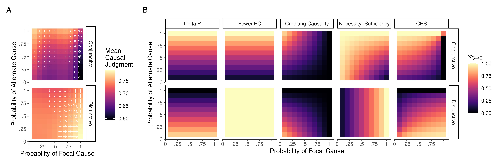

Currently, my main interest is in answering how people determine the
cause(s) of events in their lives. Psychologists and philosophers have
long thought that people make causal judgments by thinking about about
what would have happened in different circumstances. However, we still
don't know a lot about which circumstances people think about, how
many different circumstances they think about, or why.

In one branch of this research, I am investigating this process using
eye-tracking. Previous research has shown that when people are given
videos like the one below and asked "Did the blue ball score because
the orange ball moved left?", they tend to look where the blue ball
would have moved if the orange ball had moved right. In work with
Dr. Paul Bello, I helped to explain this behavior using a
computational model of counterfactual thought (Bello et al., 2018). In
an ongoing experiment, I'm studying whether these sorts of eye
movements are supported by visual mental imagery (Krasich, O'Neill et
al., 2022).

<video width="400" height="300" autoplay loop>
	<source src="../images/causal-judgment-lami.mp4">
</video>

In the other branch of this research, I'm looking at people's ability
to estimate their confidence in their causal judgments. In one study,
we found that when people are confident, they tend to say that an
event is either a cause or not. But when they are unsure, they are
likely to use qualified ratings like "partially caused" (O'Neill et
al., 2022). In another study, I derived predictions from
counterfactual sampling models of causal judgments about effects of
probability on confidence in causal judgments. While many versions of
this model failed to predict human confidence reports, one version of
our model successfully predicted both causal judgments and confidence
in those judgments (O'Neill et al., 2021).

## References:
  - [Bello, P., Lovett, A., Briggs, G., & O’Neill, K. (2018). An attention-driven model of human causal reasoning. Proceedings of the 40th Annual Meeting of the Cognitive Science Society.](https://cogsci.mindmodeling.org/2018/papers/0264/0264.pdf)
  - [Henne, P., O’Neill, K., Bello, P., Khemlani, S., & De Brigard, F. (2020). Norms affect prospective causal judgments. Cognitive Science.](https://doi.org/10.1111/cogs.12931)
  - [Krasich, K., O’Neill, K., & De Brigard, F. (2022). Eye tracking mental simulations during retrospective causal reasoning.](https://osf.io/rzbja/)
  - [O’Neill, K., Henne, P., Bello, P., & De Brigard, F. (2022). Confidence and gradation in causal judgments.](https://osf.io/m5w9c/)
  - [O’Neill, K., Henne, P., Pearson, J., & De Brigard, F. (2021). Measuring and modeling confidence in human causal judgment. Workshop on Metacognition in the Age of AI: Challenges and Opportunities, 35th Conference on Neural Information Processing Systems (NeurIPS 2021), Sydney, Australia.](https://psyarxiv.com/cgvwf)
