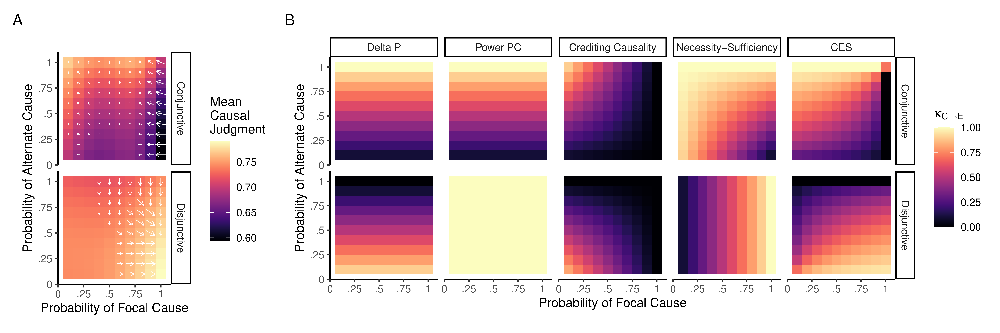

My main interest in graduate school was in answering how people
determine the cause(s) of events in their lives. Psychologists and
philosophers have long thought that people make causal judgments by
thinking about about what would have happened in different
circumstances. However, we still don't know a lot about which
circumstances people think about, how many different circumstances
they think about, or why.

In one branch of this research, I aim to show that counterfactual
models are necessary for explaining causal judgments. In a line of
studies, for example, I found that counterfactual thinking explains
causal judgments of double prevention. For instance, if Jack tries to
catch a bottle knocked over by Mike, but Peter accidentally bumps into
Jack, people tend to think that Mike knocking over the bottle (but not
Peter knocking into Jack) caused the bottle to spill. We found that
this is, at least in part, because people are more likely to imagine
Mike not knocking the bottle over than they are to imagine Peter not
knocking into Jack (Henne & O'Neill, 2022; O'Neill, Quillien, & Henne,
2022). Recently, I found that counterfactual thinking can also explain
how this preference is modulated by temporal differences (Quillien,
O'Neill, & Henne, 2025) and norms (O'Neill et al., 2025) in a way that
cannot be explained by competing theories.

In another branch, I am investigating this process using
eye-tracking. Previous research has shown that when people are given
videos like the one below and asked "Did the blue ball score because
the orange ball moved left?", they tend to look where the blue ball
would have moved if the orange ball had moved right. In work with
Dr. Paul Bello, I helped to explain this behavior using a
computational model of counterfactual thought (Bello et al., 2018). In
an eye-tracking experiment, I found that people make these sorts of
counterfactual eye movements, supported by visual mental imagery, when
making causal judgments (Krasich, O'Neill et al., 2024).

<video width="400" height="300" autoplay loop>
	<source src="../images/causal-judgment-lami.mp4">
</video>

Finally, I'm looking at people's ability to estimate their confidence
in their causal judgments. In one study, we found that when people are
confident, they tend to say that an event is either a cause or
not. But when they are unsure, they are likely to use qualified
ratings like "partially caused" (O'Neill et al., 2022). In another
study, I derived predictions from counterfactual sampling models of
causal judgments about effects of probability on confidence in causal
judgments. While many versions of this model failed to predict human
confidence reports, one version of our model successfully predicted
both causal judgments and confidence in those judgments (O'Neill et
al., 2021).

## References:
  - [Bello, P., Lovett, A., Briggs, G., & O’Neill, K. (2018). An attention-driven model of human causal reasoning. Proceedings of the 40th Annual Meeting of the Cognitive Science Society.](https://cogsci.mindmodeling.org/2018/papers/0264/0264.pdf)
  - [Henne, P., & O'Neill, K. (2022). Double prevention, causal judgments, and counterfactuals. Cognitive science, 46(5), e13127.](https://onlinelibrary.wiley.com/doi/pdf/10.1111/cogs.13127)
  - [Henne, P., O’Neill, K., Bello, P., Khemlani, S., & De Brigard, F. (2020). Norms affect prospective causal judgments. Cognitive Science.](https://doi.org/10.1111/cogs.12931)
  - [Krasich, K.\*, O'Neill, K.\*, & De Brigard, F. (2024). Looking at Mental Images: Eye‐Tracking Mental Simulation During Retrospective Causal Judgment. Cognitive Science, 48(3), e13426.](https://doi.org/10.1111/cogs.13426)
  - [O'Neill, K., Henne, P., Bello, P., Pearson, J., & De Brigard, F. (2022). Confidence and gradation in causal judgment. Cognition, 223, 105036.](https://www.sciencedirect.com/science/article/pii/S0010027722000245)
  - [O’Neill, K., Henne, P., Pearson, J., & De Brigard, F. (2021). Measuring and modeling confidence in human causal judgment. Workshop on Metacognition in the Age of AI: Challenges and Opportunities, 35th Conference on Neural Information Processing Systems (NeurIPS 2021), Sydney, Australia.](https://psyarxiv.com/cgvwf)
  - [O'Neill, K., Henne, P., Quillien, T., Icard, T., & DeBrigard, F. (2025). Norms moderate causal judgments in cases of double prevention. In Proceedings of the Annual Meeting of the Cognitive Science Society (Vol. 47).](https://escholarship.org/content/qt2g03w5x4/qt2g03w5x4.pdf)
  - [O’Neill, K., Quillien, T., & Henne, P. (2022). A counterfactual model of causal judgment in double prevention. In Conference in computational cognitive neuroscience.](https://2022.ccneuro.org/proceedings/0000173.pdf)
  - [Quillien, T., O’Neill, K., & Henne, P. (2025). A counterfactual explanation for recency effects in double prevention scenarios: commentary on Thanawala and Erb (2024). Cognition, 106106.](https://doi.org/10.1016/j.cognition.2025.106106)
