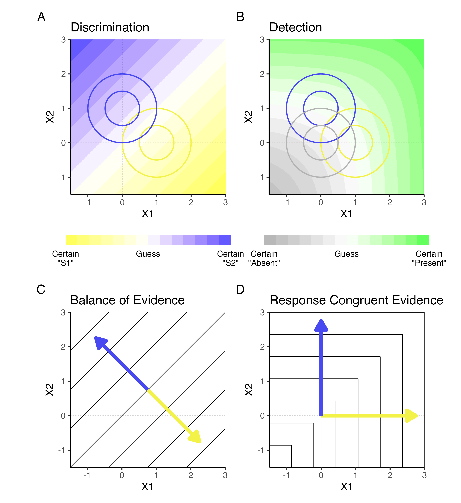
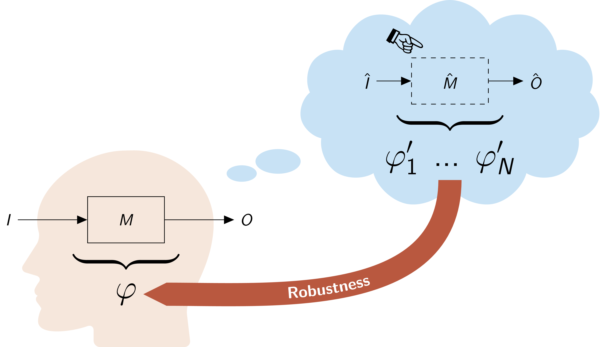
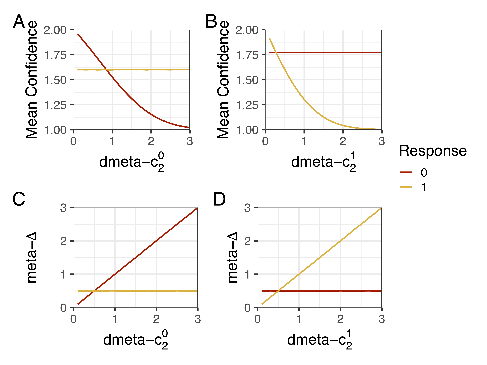
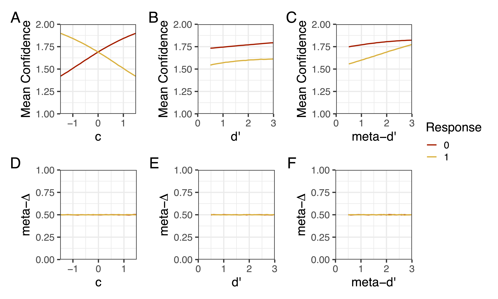

In my postdoc, I am focusing on computational models of metacognition
to answer questions like "how do we know how confident to be?", "how
does confidence relate to judgments of possibility?", and "how does
confidence guide reasoning and decision-making?". I am especially
interested in interactions between metacognition (i.e., monitoring and
controlling our thoughts and behaviors) and modal cognition (i.e.,
reasoning about alternative/hypothetical possibilities).

In one project, I helped to formalize a rational Bayesian model of
confidence ratings that explains apparent biases in people's
metacognition (Łuczak, O'Neill, & Fleming, 2024). According to optimal
theories of metacognition, people should rate confidence as the
subjective probability that their decision was correct. So, when
choosing between options, it is usually seen as best for people to
choose the option with the most evidence and to rate their confidence
as a function of the difference in evidence between the chosen and
unchosen option (Panels A/C). But people's actual confidence ratings
tend only to vary as a function of the evidence for the option they
chose (response congruent heuristic; Panel D), which instead
resembles the optimal confidence rating for a detection task (Panel
B).

{: style="width: 50%; display: block; margin: auto;" }

Instead of treating this as a maladaptive bias, we found out that
there was a rational explanation for people's behavior; even when
experimenters force people to choose between two options, people might
be considering a broader hypothesis space. For example, if you are
asked to choose whether a handwritten digit is a "4" or a "6",
previous theories suggest that you **only** consider these two
options. But sometimes an image might nevertheless look like an "8",
even if you aren't allowed to choose this option. If we take this into
account, for a hypothesis space with *K* dimensions corresponding to
each of *K* represented possibilities, we get optimal predictions of
confidence that look increasingly like the response congruent
heuristic (Panel A):

{: style="width: 75%; display: block; margin: auto;" }

The other panels in this figure just confirm that this indeed reflects
a positive evidence bias: the optimal confidence rating is more
sensitive to changes in the evidence for the chosen option relative to
unchosen options. I think this work is important for two
reasons. First, it is a good example of a task in which what appears
to be a suboptimal short-cut in people's reasoning can actually be
seen as an optimal solution to a different problem. Second, it points
to a deep connection between how people represent alternative
possibilities and how they rate confidence, which is something I'm
hoping to explore further. For instance, I'm working on a theoretical
framework defining metacognition as a kind of modal cognition, in
which people can predict and intervene on a self-model to imagine what
they would have thought or done if things had been different:

{: style="width: 75%; display: block; margin: auto; background: white;" }

---

In addition to optimal theories of metacognition, I've also been
diving into more practical issues concerning the measurement of
metacognition. Following traditions in psychophysics, psychologists
often seek ways to independently quantify different factors governing
behavior. One common way to do this is to use [signal detection
theory](https://en.wikipedia.org/wiki/Detection_theory): assuming that
people noisily encode a presented stimulus, they make a judgment by
comparing their encoded evidence to a response criterion. This results
in two independent quantities: (a) *sensitivitity*, the average
difference in encoded evidence depending on the stimulus, and (b)
*response bias*, the overall tendency to make one response or the
other. Using an extension of classical signal detection theory called
the meta-d' model, metacognition researchers also measure
*metacognitive sensitivitity*, the degree to which confidence ratings
are sensitive to decision accuracy (Maniscalco & Lau, 2012).

When its assumptions are met, this model tends to work well in terms
of separating out metacognitive factors from cognitive factors. But
fitting this model can tend to be complicated, requiring hand-coding
for different experimental designs and lots of data wrangling to
aggregate confidence ratings and produce model predictions. To
alleviate this problem, I wrote [the hmetad
package](https://metacoglab.github.io/hmetad/) in the programming
language `R`, which allows users to fit the meta-d' model in a
Bayesian framework with a `lmer`-style `R` formula syntax through the
package `brms` (O'Neill & Fleming, 2026). Since it is written in the
probabilistic programming language `Stan`, the model is heavily
optimized for efficiency and gives very informative convergence
diagnostics. I've also included lots of functions for producing model
predictions (e.g., mean confidence, receiver operating characteristic
curves) that help with prior elicitation and posterior predictive
checks. For example, the package makes it easy to make plots like
these:

{: style="width: 40%; margin: auto;" } {: style="width: 40%; margin: auto;" }

Finally, whereas most of the field's attention has been turned to
metacognitive sensitivity, I've been focusing on developing measures
of *metacognitive bias*, i.e., one's overall level of over- or
under-confidence. The most common strategy for doing this in
psychology is simply to take the average of a large number of
confidence ratings over repeated trials of the same task, with the
intuition that people that give higher confidence ratings are more
confident. But this is known to be problematic. Imagine that two
people give the same confidence ratings on average, but one person is
much better at the task. Here we would want to say that the person who
is better at the task is underconfident compared to the other person,
but mean confidence cannot capture this difference. It is also
confounded by metacognitive sensitivity: people who are better able to
predict whether their decision is correct by definition have higher
mean confidence! In response, I've developed a new model-based measure
of metacognitive bias based on the meta-d' model described above
(O'Neill, Zhan, & Fleming, 2026). Importantly, it is just as sensitive
to differences in confidence criterion (Panels C-D) setting as mean
confidence (Panels A-B):

{: style="width: 75%; display: block; margin: auto;" }

But critically, unlike mean confidence (Panels A-C), our new measure
is unconfounded by task-level sensitivity, response bias, and
metacognitive sensitivity (Panels D-F):

{: style="width: 75%; display: block; margin: auto;" }

Thankfully, testing our measure on a longitudinal dataset, we found
that it has high test-retest reliability:

{: style="width: 75%; display: block; margin: auto;" }

In addition to contributing to theories of confidence formation and
reporting, I hope that these psychological measures can increase the
reliability and validity of metacognition research.

## References:
  - [Łuczak, W., O'Neill, K., & Fleming, S. M. (2026). Confidence is detection-like in high-dimensional spaces. arXiv e-prints, arXiv-2410.](https://arxiv.org/abs/2410.18933)
  - [Maniscalco, B., & Lau, H. (2012). A signal detection theoretic approach for estimating metacognitive sensitivity from confidence ratings. Consciousness and cognition, 21(1), 422-430.](https://doi.org/10.1016/j.concog.2011.09.021)
  - [O'Neill, K. & Fleming, S. (2026). hmetad: Fit the meta-d' model of confidence ratings using 'brms'. R package version 0.1.0.9000](https://metacoglab.github.io/hmetad/)
  - O'Neill, K., Zhan, T., & Fleming, S. (2026). A measure of metacognitive bias you can be confident in. 

