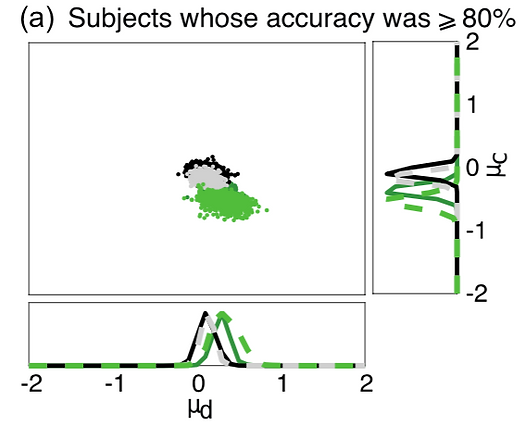
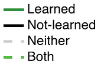
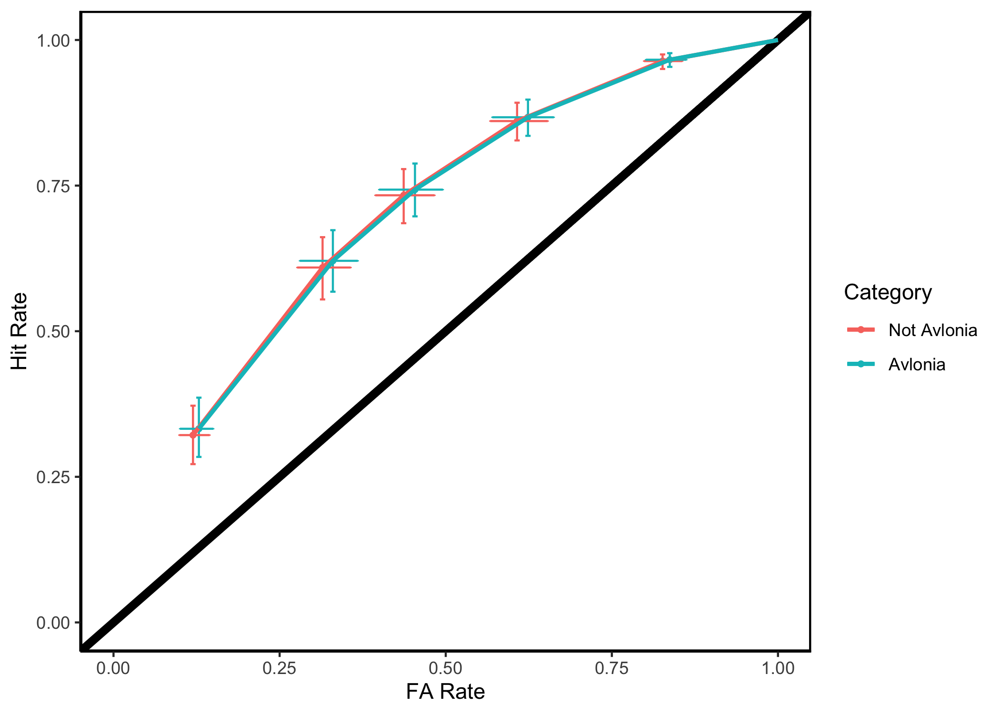

Along with collaborators in the [Imagination and Modal Cognition
Lab](https://www.imclab.org), this line of research investigates how
past experiences with categories can affect memory for items in that
category.

It is well-known that people fill in gaps in their memory using
learned schemas, or templated memory structures. For instance, when
recalling a visit to the doctor, many people might remember their
doctor wearing a white lab coat and a stethoscope around their neck,
since these are typical things for doctors to wear. Usually this
feature of memory helps us remember accurately, since it is
impossible to remember every single detail of a memory accurately. But
decades of memory research shows that we tend to exhibit this bias
even when it harms us: we remember the stereotypical doctor even if
this memory is false.

We wanted to investigate how these tendencies are learned over
time. But, schema learning is hard to study because schemas typically
take a lot of time and experience to learn. So, we drew a parallel
between schemas and simple categories, which are readily
learnable. Specifically, we made the flowers below, which vary in
terms of petal count and color, center shape and color, and sepal
count:

	
	
	

Across several studies (De Brigard et al., 2017; O'Neill et al., 2021;
Yin et al., 2019), we've found support for the same overall effects:
people are more likely to remember flowers from newly learned
categories (e.g., an *avlonia* is a flower with red petals) that they
actually saw, but they are also more likely to *falsely* remember
seeing a flower from that category. These effects only appear for
people that successfully learn the category (Yin et al., 2019), and
they appear regardless of how the category was learned (e.g., through
supervised practice or explicit instruction; O'Neill et al., 2021).

Finally, we characterized these memory using signal detection
analysis, a computational model designed to deconfound *sensitivity*
(i.e., memory accuracy) from *bias* (i.e., response tendency). We
found that people who learned the category well had an increased bias:
they tended to report that they had previously seen flowers in the
learned category whether or not they actually saw that flower in the
past:

## References:
  - [De Brigard, F., Brady, T.F., Ruzic, L. et al. Tracking the emergence of memories: A category-learning paradigm to explore schema-driven recognition. Memory & Cognition 45, 105–120 (2017).](https://doi.org/10.3758/s13421-016-0643-6)
  - [O’Neill, K., Liu, A., Yin, S., Brady, T., & De Brigard, F. (2021). Effects of category learning strategies on recognition memory. Memory & cognition, 1–15.](https://doi.org/10.3758/s13421-021-01207-9)
  - [Yin, S., O’Neill, K., Brady, T., & De Brigard, F. (2019). The effect of category learning on recognition memory: a signal detection theory analysis. Proceedings of the 41st Annual Meeting of the Cognitive Science Society.](https://cogsci.mindmodeling.org/2019/papers/0532/0532.pdf)
