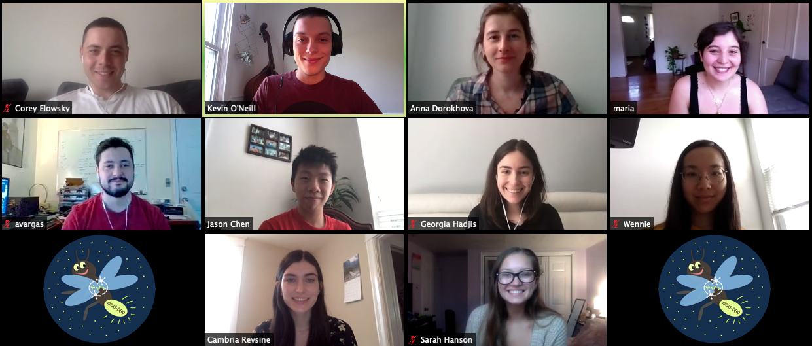

In the summer of 2020 I was a teaching assistant for the first session of [Neuromatch Academy](https://www.neuromatchacademy.org/)! Over three weeks I guided my 9 students through a whirlwind tour of everything computational neuroscience, from basic modeling concepts (e.g., "What is a model?"), regression models, and python programming, to more advanced models like Hidden Markov Models, RL models, and deep neural networks. Finally, I helped my 9 students split into two groups to create their own long-term group projects.

Here's a photo of my pod!

