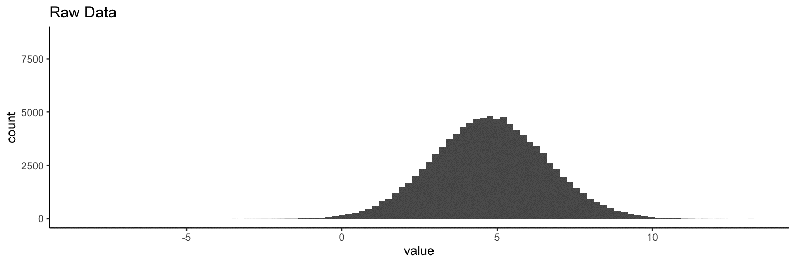
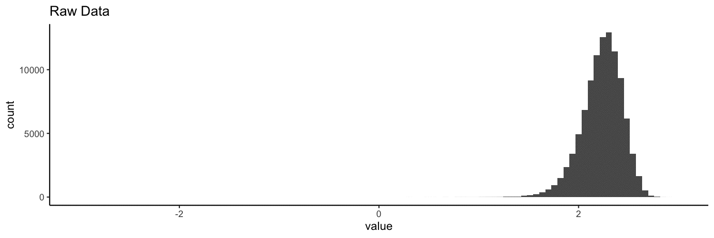
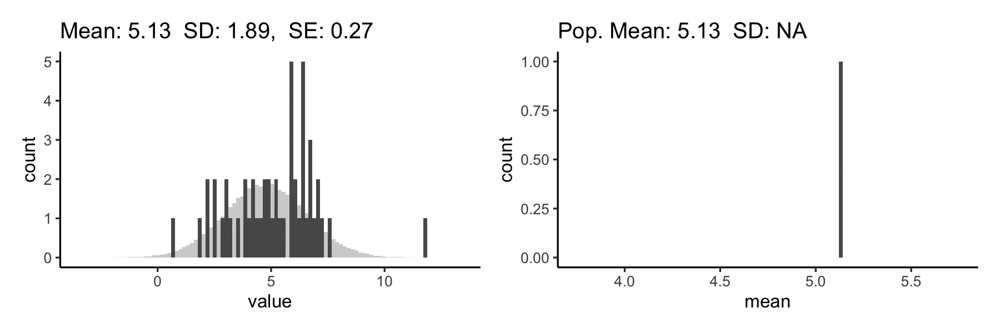
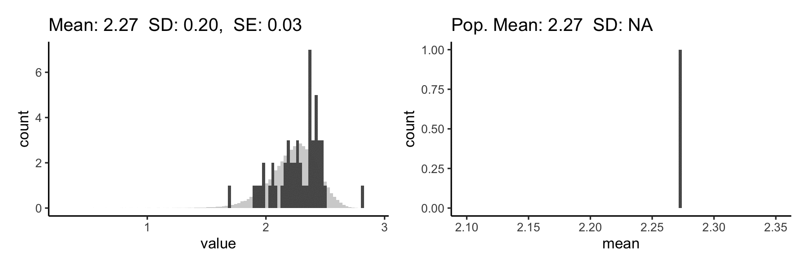

In Spring 2021 I was a graduate teaching assistant for Dr. Angela
Vieth's course PSY 204L: Quantitative Research Methods & Statistics
for Psychological Science. As the title suggests, we focused on
building a strong foundation of methods & statistics with the goal of
making the math more accessible. For example, we covered how z-scoring
can be seen as a combination of centering and scaling that preserves
any skew in the data:

We also talked a bit about estimating means and CIs using the central
limit theorem:

Finally, I guided students through the process of finding a research
question, scouring the literature, and pre-registering a study to
answer that question. My students came up with studies on topics
including exercise & mental health, social media usage & political
polarization, and diversity in the fashion industry!
